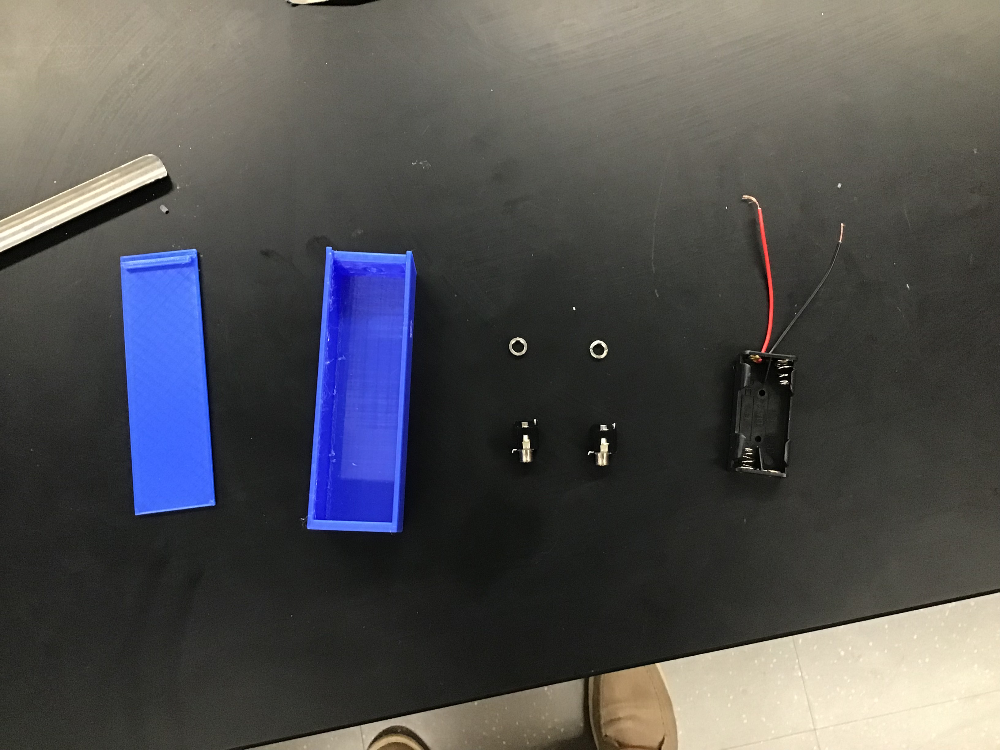
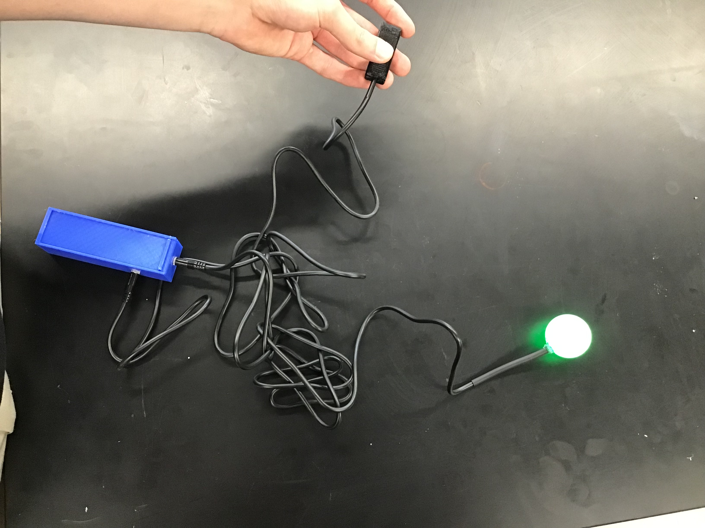
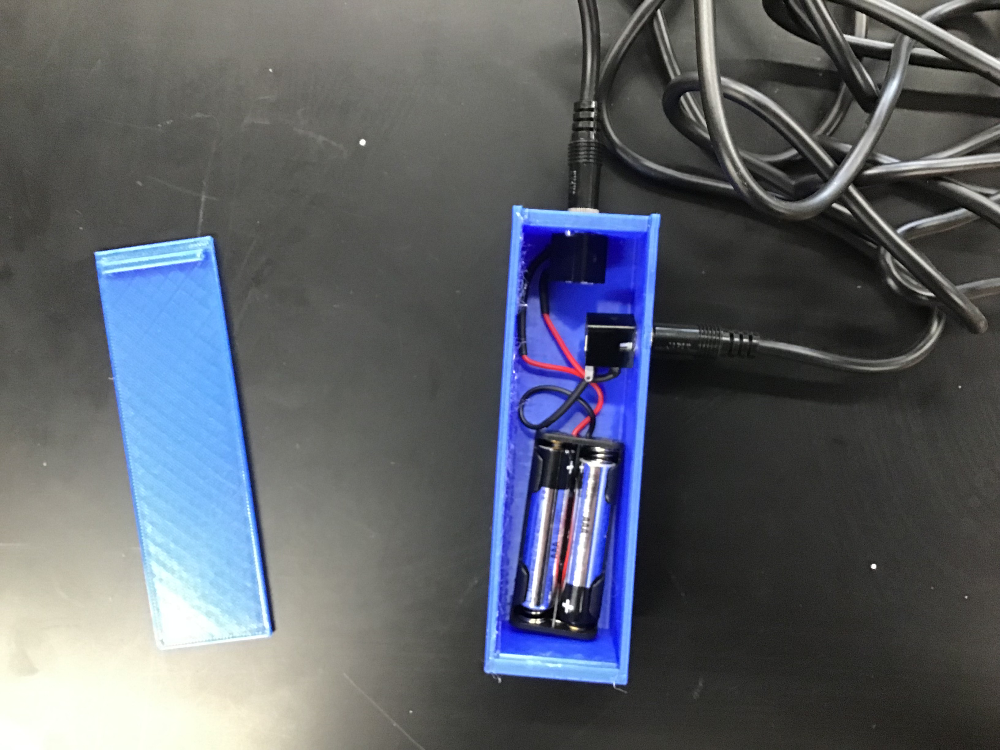

# Assisted Hand Raiser Mechanism
## General Overview
The project involved simple wiring and a switch to turn on a light powered by a set of batteries.
## How It Works
Using two 6mm jacks connected to a battery pack in a 3d printed box, wires ran through a type of tubing (rubber or pvc) and connected to a light. The light then could be turned on through any type of switch (the one we included was a simple switch to click with a hand or foot).
The battery pack is anchored in the box as well as wiring, and the box has a lid that can be easily opened and closed by sliding.
## Images of Project

This image shows the parts we used to compile the project including the 3d printed box

This is the final result of the project, with the switch being pressed and the light turned on

This is what the put together project looks like with the lid off showing the wiring.
## Project Purpose
The intent for this device was to create a way for people to raise their hand without having to raise their hand. This is meant to assist those who face certain movement difficulties where raising there hand is difficult or impossible and need an alternative method to signal for a teacher's/mentor's attention.
## Where the Parts Came From
[AAA Battery Holder](https://www.amazon.com/gp/product/B07F3YKGPD/ref=ppx_yo_dt_b_search_asin_title?ie=UTF8&psc=1)

[3.5 mm Jack](https://www.allelectronics.com/item/mmj/3.5mm-mono-open-audio-phone-jack/1.html)

3.5MM MONO PHONE PLUG, 6 FT. CABLE
