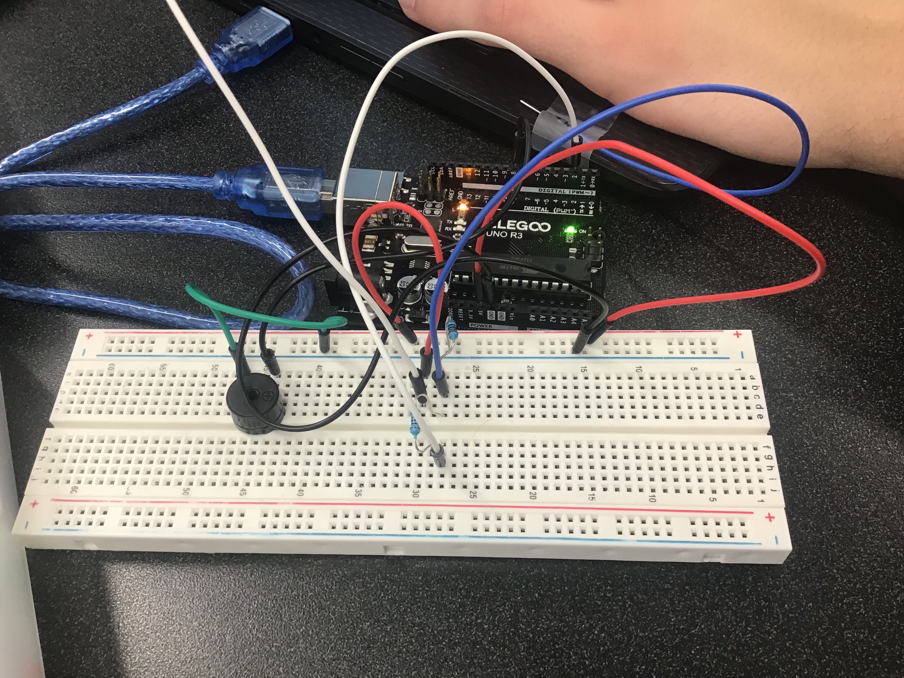

# Interesting Button Project
## Project Description
The project entailed adding a rudimental security system to a laptop, so that when it is opened a sound is emitted from a speaker.
In doing so, two wires were used (one attached to the screen border and one by the keyboard) and when they were touching the sound was set off. 
If the laptop was opened then the sound would play.
## Visuals of Project

This is a general overview of what the project looked like.

Wiring to the circuitboard and Arduino for project

In this state the alarm would be active, as the wires are not connected

## Demonstration of the Project

## Project Code
`
int buttonPin = 2;
int buttonState = 0;

void setup() {
  Serial.begin(9600);
  pinMode(buttonPin, INPUT);
}

void loop() {
  delay(100);
  buttonState = digitalRead(buttonPin);
  if (buttonState == LOW)
  {
   tone(8, 440,100);
  }
 
}
`
