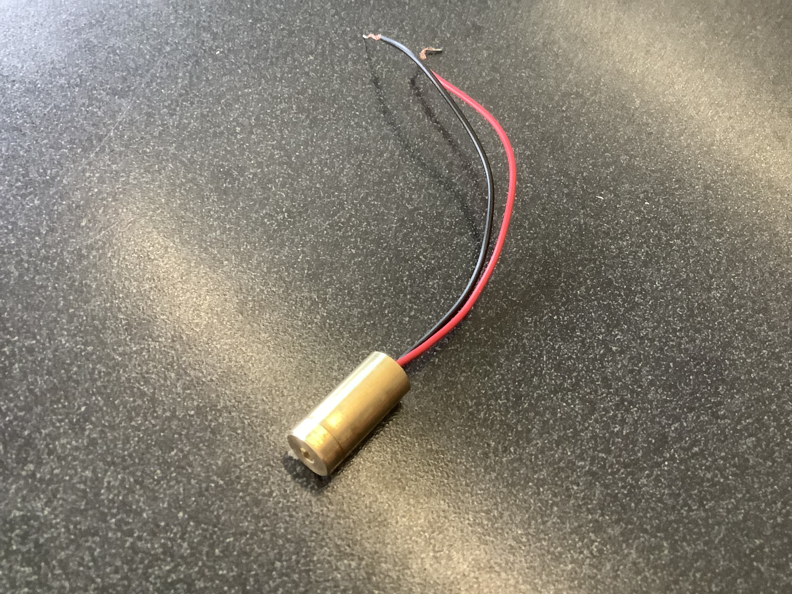
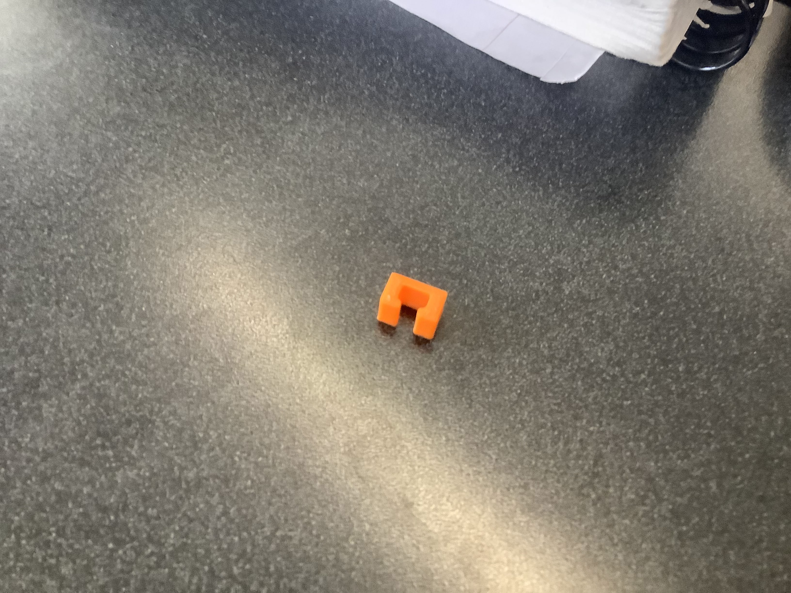
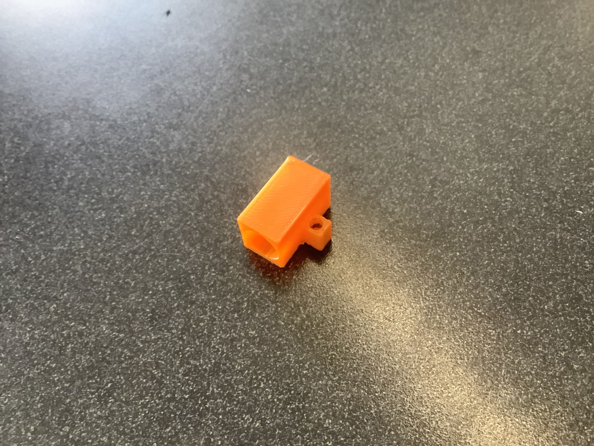
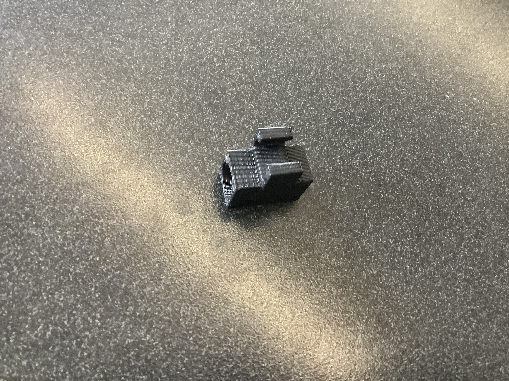

# Laser Pointer Glasses Attachment
## General Overview
This project involved creating a 3D model of an attachment that can hold a laser pointer and attach to glasses.
## How It Works
Using two 3.5mm jacks connected to a battery pack in a 3d printed box, wires attach to the 3D printed laser pointer attachment as well as a switch.

## Images of Project

This image shows the laser we used for the project.

This is a prototype clip that was made to test its fit on glasses.

This is a prototype of a laser pointer holder.

The final version of the laser pointer and clip.

Laser pointer in clip on with battery.

Box that can be used to hold battery pack.

## Project Purpose
This attachment was created in order to allow individuals to point at objects using their glasses. This is meant to assist individuals who would have difficulty being able to point out objects.
## Where the Parts Came From
[AAA Battery Holder](https://www.amazon.com/gp/product/B07F3YKGPD/ref=ppx_yo_dt_b_search_asin_title?ie=UTF8&psc=1)

[3.5 mm Jack](https://www.allelectronics.com/item/mmj/3.5mm-mono-open-audio-phone-jack/1.html)

Laser: 3 Volt Laser module from Ali Express https://m.aliexpress.us/?gatewayAdapt=glo2usa

Box: Attached STL File

Laser Pointer Attachment: Attached STL File

Code for Laser Pointer on OpenSCAD: [Code](https://github.com/CNeiheisel/Connor-and-Nathan-s-Repository/blob/ff0739a41db41852ee6237523c5bc127fe304994/Laser%20Pointer%20Attachment/ClipOnLaserPointer.scad)
