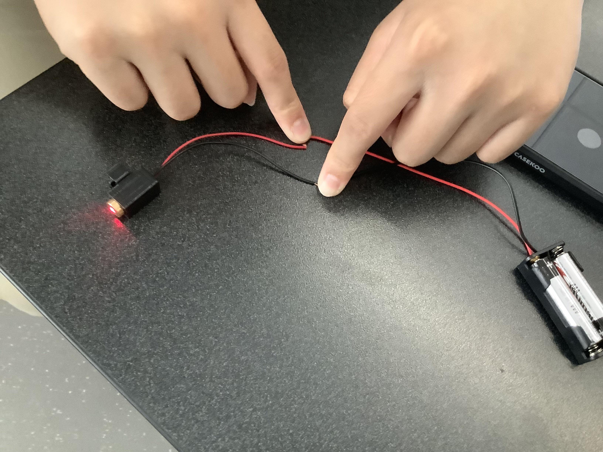

# Laser Pointer Glasses Attachment
## General Overview
This project involved creating a 3D model of an attachment that can hold a laser pointer and attach to glasses.
## How It Works
Using two 3.5mm jacks connected to a battery pack in a 3d printed box, wires attach to the 3D printed laser pointer attachment as well as a switch

## Images of Project

## Project Purpose
This attachment was created in order to allow individuals to point at objects using their glasses. This is meant to assist individuals who would have difficulty being able to point out objects using other methods.
## Where the Parts Came From
[AAA Battery Holder](https://www.amazon.com/gp/product/B07F3YKGPD/ref=ppx_yo_dt_b_search_asin_title?ie=UTF8&psc=1)

[3.5 mm Jack](https://www.allelectronics.com/item/mmj/3.5mm-mono-open-audio-phone-jack/1.html)

Box: Attached STL File

Laser Pointer Attachment: Attached STL File
