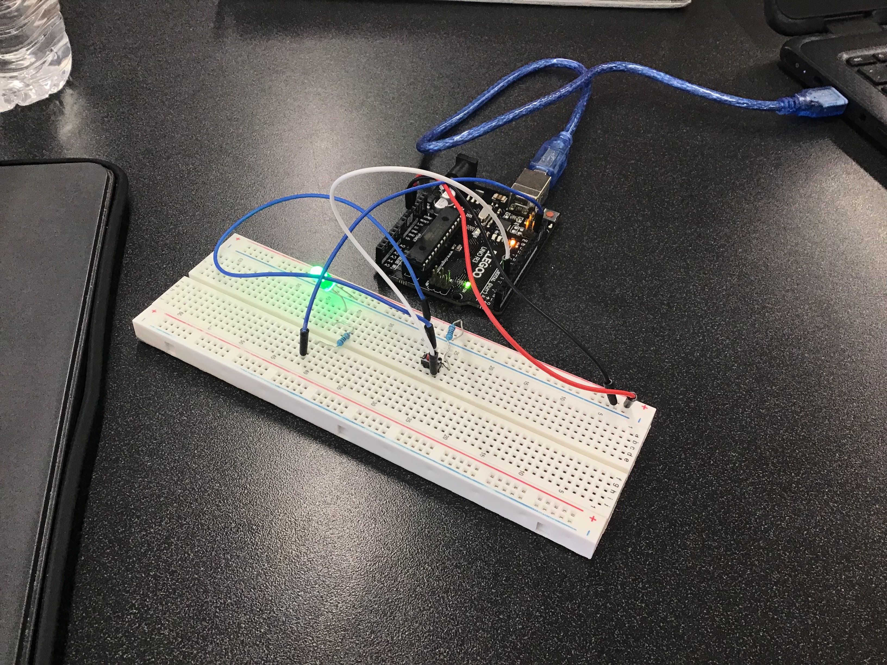

# Chapter 5 Project: Light Game
## Project Description
We made a game where one player's reaction time is tested by clicking the button when the light flashes on. 
The light will flash on after a short random time interval and the player must quickly press the button to continue playing
If they don't the light will flash on and off briefly before lighting constantly.
Then the player's score, the amount of successful button presses in the interval, will be displayed on the Serial Monitor.
In order to restart and play again, the player must simply press the button again and the game will restart with a reset score.
## Images of Project

This is the game and the wiring for the circuit board.

This is the score pop-up in the serial monitor after a finished game.
## Video of Project

This is a video of the game being played and the results on the Serial Monitor.
